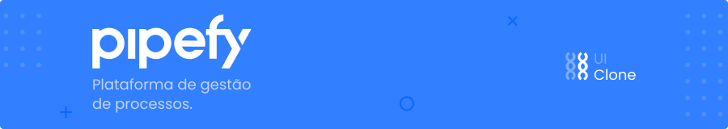

<h1 align="center">
    
</h1>

<p align="center">
 
  
</p>

##  About

This is a clone of the Pipefy interface developed with ReactJS! In the project technologies such as styled-components and drag n' drop were used. 

Because, it is a simple project, focusing on the use of drag n' drop, some current pipefy features have not a been replicated, but if you want to contribute you can make a project fork and implement it as you wish.


##  What is the Pipefy?

Pipefy is a workflow demand control plataform. You can learn more about it <b><a href="https://pipefy.com">here</a></b>.


##  What is the UI Clone?

UI Clone is a project developed and applied by <a href="https://github.com/Rocketseat">@rocketseat</a> where the interface of several applications that are on the rise in recent years is recreated.

You can see more <b><a href="https://www.youtube.com/watch?v=awRtgpRsdTQ&list=PL85ITvJ7FLohTZv9cC5-PrZ39Q3cugWqp">here</a></b>!


##  Run project

Git the project clone, install the dependencies with ```yarn``` or ```npm``` and run project with ```yarn start``` or ```npm start```.

If you have any questions, you can consult the yarn and npm documentation <b><a href="https://classic.yarnpkg.com/en/docs/installing-dependencies/">here</a></b> and <b><a href="https://docs.npmjs.com/cli/install">here</a></b>.

---

Made with ❤ by Julia Bresolin! <br>
<small>[Follow me on social networks!](https://linktr.ee/juliabresolin)</small>